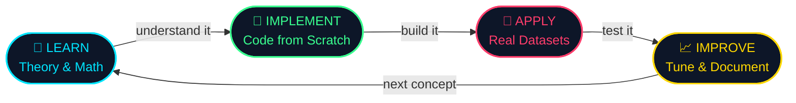
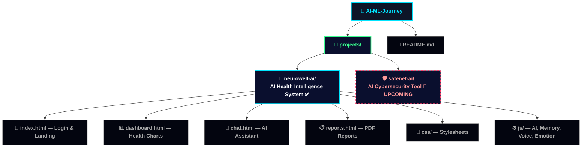
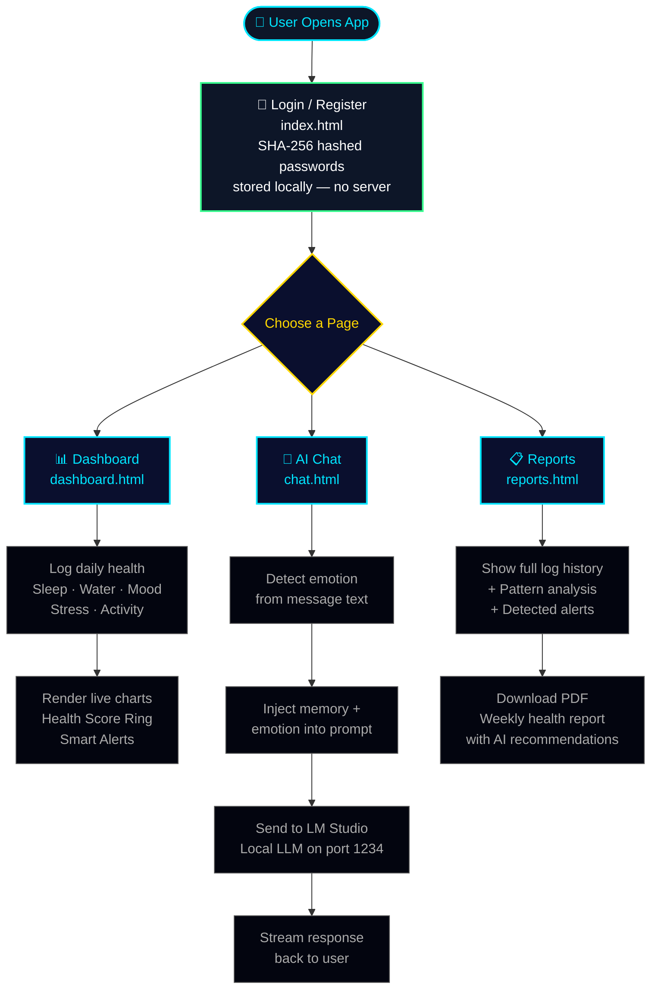
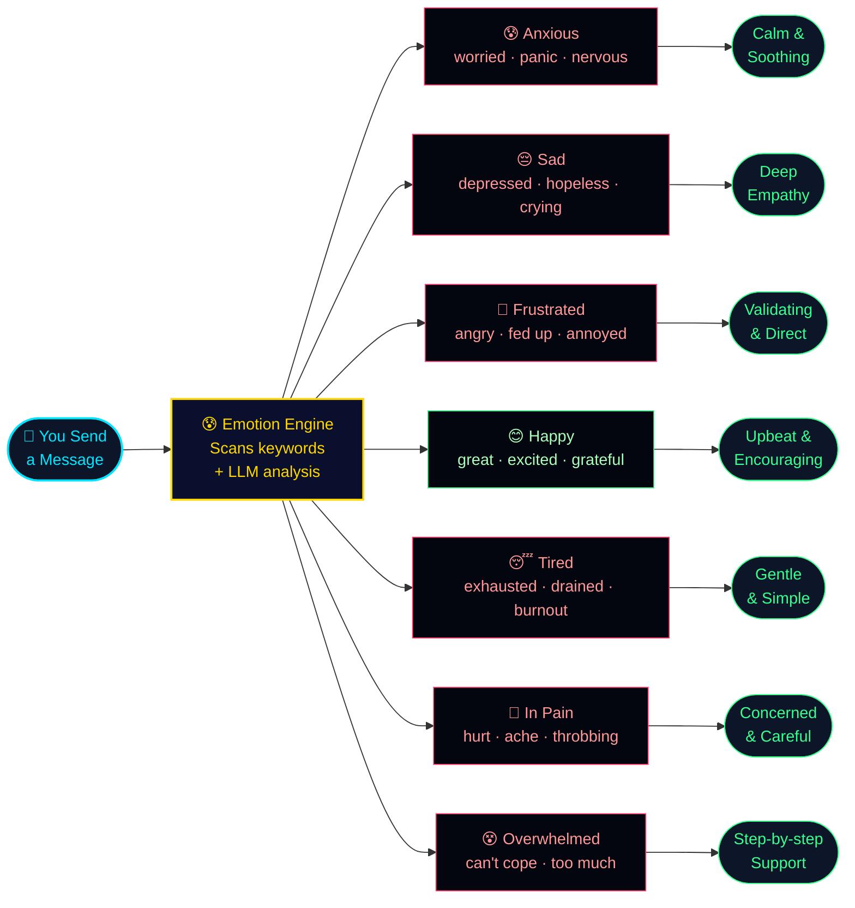
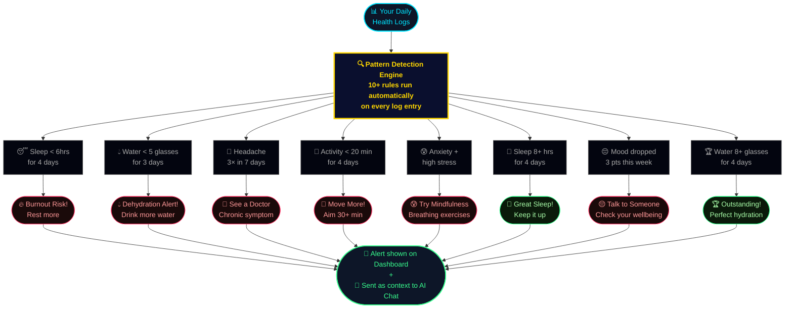
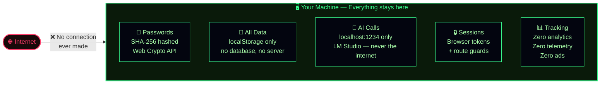
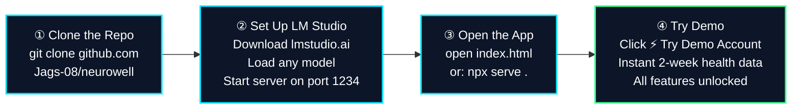
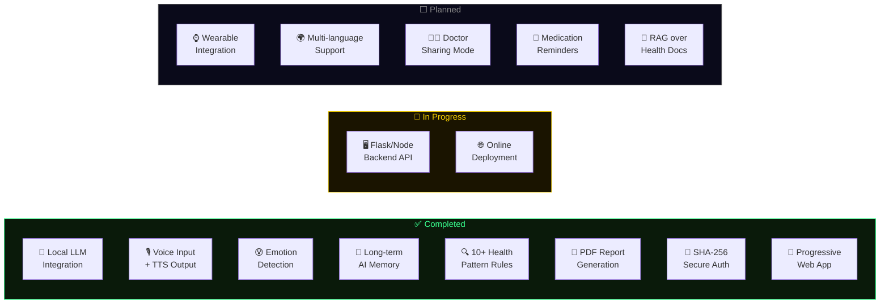
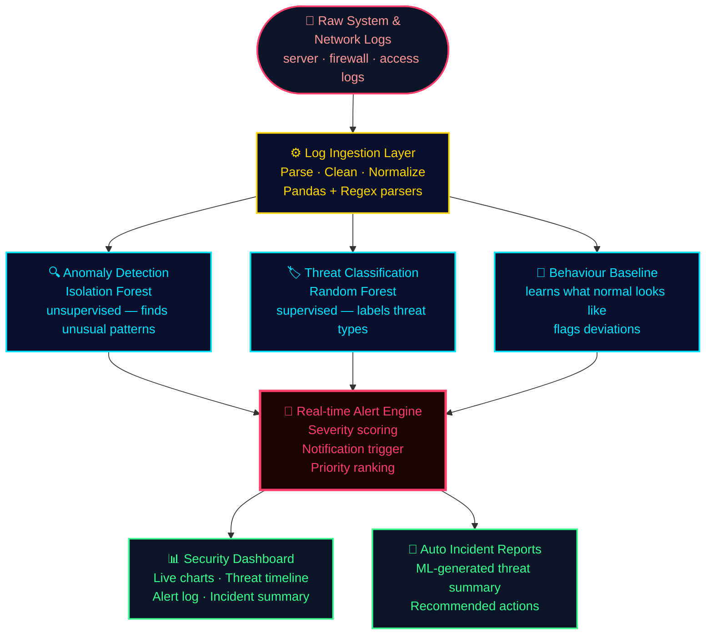
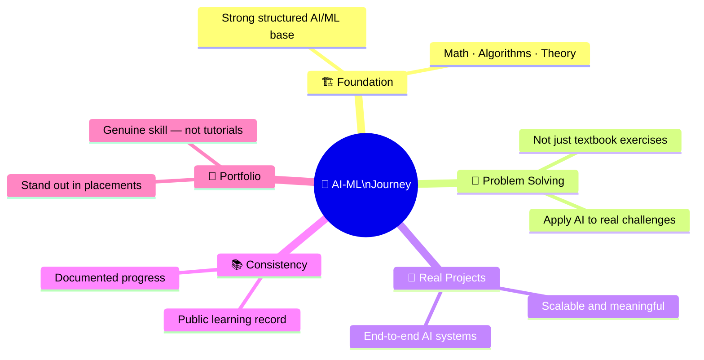

<div align="center">


<br/>


<br/><br/>


<br/>


</div>

<br/>

---

<br/>

## 🧭 What is This Repository?


This is my **personal AI/ML learning and project repository** — a structured, hands-on record of everything I've learned and built in Artificial Intelligence and Machine Learning.

It's not just theory. Every concept becomes **working code**, and every project here is something I **actually designed and built from scratch**.

> 💡 Think of it as a **public builder's journal** — where learning meets real-world application.

<br/>

**What you'll find here:**
- 🤖 Real AI projects — built end-to-end, not just tutorials
- 📊 Hands-on implementations of ML algorithms
- 🧠 Deep learning architectures applied to real problems
- 📁 Clean, structured, well-documented code

<br clear="right"/>

<br/>

---

<br/>

## 🔄 My Learning Philosophy

> Everything in this repository follows one core loop — no skipping steps:

<br/>



<br/>

> This ensures I don't just copy code — I understand **why** it works at every step.

<br/>

---

<br/>

## 📂 Repository Structure

<br/>



<br/>

> 🗂️ More modules (fundamentals, ML algorithms, datasets) will be added progressively as the journey grows.

<br/>

---

<br/>

## 🚀 Projects

<br/>

<div align="center">

| | Project | Status | Description |
|--|---------|--------|-------------|
| 🧠 | **NeuroWell AI** | `✅ Completed` | AI-powered personal health intelligence system |
| 🛡️ | **SafeNet AI** | `🔄 Upcoming` | AI-powered cybersecurity threat detection tool |

</div>

<br/>

---

<br/>

## 🧠 Project 1 — NeuroWell AI

<br/>

<div align="center">


</div>

<br/>

> **A full-stack AI-powered personal health intelligence system that runs entirely in your browser — no cloud, no external server, 100% private.**

<br/>

### 💡 The Core Idea

<br/>

<div align="center">

```
Most health apps just track numbers.
They don't understand you, talk to you, or remember you.

NeuroWell is different.
```

</div>

<br/>

<div align="center">

| Without NeuroWell | With NeuroWell |
|:-----------------:|:--------------:|
| ❌ Just a number tracker | ✅ Talks to you via AI chat |
| ❌ Forgets everything | ✅ Remembers your health history |
| ❌ Ignores your mood | ✅ Detects your emotion in real-time |
| ❌ Generic advice | ✅ Personalized AI recommendations |
| ❌ Cloud dependent | ✅ 100% local — your data never leaves |
| ❌ No insights | ✅ Auto-generated PDF health reports |

</div>

<br/>

> 💡 Think of it as a **personal AI doctor friend** — always available, always private.

<br/>

---

### 🔁 How NeuroWell Works — Full System Flow

<br/>



<br/>

---

### ✨ Features Breakdown

<br/>

<div align="center">

| # | Feature | What It Does | How It Works |
|:-:|---------|-------------|--------------|
| 01 | 🤖 **Local AI Chat** | Chat with an AI about your health | Connects to LM Studio (local LLM), streams responses live |
| 02 | 🧠 **Long-term Memory** | AI remembers your past symptoms & goals | Custom memory engine saves & injects context to localStorage |
| 03 | 😰 **Emotion Detection** | Detects how you're feeling from your words | Keyword heuristics + LLM analysis runs on every message |
| 04 | 🎙️ **Voice Input** | Speak instead of type | Web Speech API captures & converts speech to text |
| 05 | 🔊 **TTS Readback** | AI speaks its response aloud | Speech Synthesis API with speed & pitch controls |
| 06 | 📊 **Health Dashboard** | Visual charts for all your health metrics | Chart.js renders sleep, water, mood, stress & activity |
| 07 | 🔍 **Pattern Detection** | Warns you about risky health trends | 10+ rule engine continuously checks your logs |
| 08 | 📄 **PDF Reports** | Generates a weekly health summary PDF | jsPDF auto-builds a report with AI recommendations |
| 09 | 🔐 **Secure Auth** | Login / register with hashed passwords | SHA-256 via Web Crypto API + session route guards |
| 10 | 📱 **PWA + Offline** | Works offline, installable like a native app | Service Worker caches all assets for offline use |

</div>

<br/>

---

### 😰 Emotion Detection — How the AI Adapts to You

<br/>



<br/>

---

### 🔍 Smart Health Pattern Detection Engine

<br/>



<br/>

---

### 🔐 Privacy & Security Architecture

<br/>



<br/>

---

### 📁 NeuroWell File Structure

<br/>

```
neurowell-ai/
│
├── 📄 index.html         ← Landing + Login / Register page
├── 📊 dashboard.html     ← Health hub: charts, log form, alerts
├── 🧠 chat.html          ← AI assistant with voice & emotion
├── 📋 reports.html       ← Data table + pattern analysis + PDF
├── 📱 manifest.json      ← PWA config (makes it installable)
├── ⚙️  sw.js             ← Service Worker (enables offline mode)
│
├── css/
│   ├── main.css          ← Global design system (dark biopunk theme)
│   ├── dashboard.css     ← Chart cards, metric tiles, log form
│   └── chat.css          ← Chat bubble UI
│
└── js/
    ├── storage.js        ← localStorage database layer
    ├── auth.js           ← Login, sessions, route protection
    ├── patterns.js       ← 10+ rule-based health pattern engine
    ├── llm-config.js     ← LM Studio connection + streaming config
    ├── memory.js         ← Long-term memory extraction & injection
    ├── emotion.js        ← Real-time emotion detection (10 emotions)
    ├── tts.js            ← Text-to-speech output module
    ├── voice.js          ← Voice input via Web Speech API
    ├── pdf.js            ← jsPDF weekly health report generator
    ├── app.js            ← Neural canvas, sidebar, toast utils
    ├── dashboard.js      ← Chart.js rendering + log form handler
    └── chat.js           ← Streaming AI chat + memory + emotion
```

<br/>

---

### ⚡ Quick Start — NeuroWell

<br/>



<br/>

```bash
git clone https://github.com/Jags-08/neurowell.git
cd neurowell
open index.html        # No install. No API keys. Just open and go.
```

<br/>

> ✅ **No npm install. No backend setup. No API keys needed.**

<br/>

---

### 🗺️ NeuroWell Roadmap

<br/>



<br/>

---

<br/>

## 🛡️ Project 2 — SafeNet AI

<br/>

<div align="center">


</div>

<br/>

> **An AI-powered cybersecurity tool that monitors, classifies, and alerts on threats — using machine learning on real system and network logs.**

<br/>

### 💡 The Problem It Will Solve

<br/>

<div align="center">

| Without SafeNet AI | With SafeNet AI |
|:-----------------:|:--------------:|
| ❌ Logs are impossible to read manually | ✅ AI scans thousands of log lines instantly |
| ❌ Threats hide in subtle patterns | ✅ ML models detect anomalies automatically |
| ❌ Alerts come after damage is done | ✅ Real-time alerts on suspicious activity |
| ❌ No visibility on threat types | ✅ Classifies threats by type and severity |
| ❌ No overview for non-technical users | ✅ Visual security dashboard for everyone |

</div>

<br/>

---

### 🔁 SafeNet AI — Planned System Flow

<br/>



<br/>

---

### 📋 Planned Features

<br/>

<div align="center">

| Feature | Description | Status |
|:-------:|-------------|:------:|
| 🔍 **Log Analysis** | Parse & analyze system/network logs for anomalies | ⬜ Planned |
| 🏷️ **Threat Classification** | Label threats: intrusion · DDoS · brute force · malware | ⬜ Planned |
| 🚨 **Real-time Alerts** | Instant alerts with severity score on suspicious activity | ⬜ Planned |
| 📊 **Security Dashboard** | Visual overview of events, severity levels, threat timeline | ⬜ Planned |
| 🧠 **Behaviour Baseline** | Learn "normal" behaviour and flag all deviations | ⬜ Planned |
| 📄 **Incident Reports** | Auto-generate threat summaries with ML insights | ⬜ Planned |

</div>

<br/>

### 🛠️ Planned Tech Stack

<br/>

<div align="center">

| Category | Tools |
|:--------:|-------|
| **Language** | Python |
| **ML Models** | Scikit-learn · Isolation Forest · Random Forest |
| **Log Parsing** | Pandas · Regex · Custom parsers |
| **Visualization** | Chart.js · Matplotlib · Seaborn |
| **Alerts** | Custom rule engine + ML severity scoring |
| **Dataset** | CICIDS · KDD Cup 99 · public security datasets |

</div>

<br/>

> 📅 Development starts soon — ⭐ star this repo to stay updated.

<br/>

---

<br/>

## 🛠️ Overall Tech Stack

<br/>

<div align="center">


<br/><br/>

| Category | Tools |
|:--------:|-------|
| **Core Languages** | Python · JavaScript · HTML · CSS |
| **Data & Math** | NumPy · Pandas · Matplotlib · Seaborn |
| **ML** | Scikit-learn · Isolation Forest · Random Forest |
| **Deep Learning** | TensorFlow · PyTorch |
| **AI / LLM** | LM Studio · OpenAI-compatible API · Streaming SSE |
| **Visualization** | Chart.js · SVG Animations · Mermaid |
| **Reports** | jsPDF |
| **Security** | Web Crypto API (SHA-256) |
| **PWA** | Service Workers · Web App Manifest |
| **Voice** | Web Speech API · Speech Synthesis API |
| **Environment** | Jupyter Notebook · VS Code · Git & GitHub |

</div>

<br/>

---

<br/>

## 🎯 Goals of This Repository

<br/>



<br/>

---

<br/>

## ⚡ Getting Started

<br/>

```bash
# Clone the full repository
git clone https://github.com/Jags-08/AI-ML-Journey.git
cd AI-ML-Journey

# Navigate to NeuroWell AI
cd projects/neurowell-ai

# Open in browser — no build step needed
open index.html
# or
npx serve .    # → http://localhost:3000
```

<br/>

---

<br/>

## 🤝 Feedback & Suggestions

If you spot a bug, have a feature idea, or just want to discuss AI and ML — feel free to open an issue or reach out directly.

Constructive feedback is always welcome. I'm learning in public, and any insight that improves this repository is appreciated.

<br/>

---

<br/>

## ⭐ Support

<div align="center">

If this repository helps you — whether you're learning AI, building something similar, or just exploring — consider giving it a ⭐

**It keeps me motivated to keep building and sharing.**

</div>

<br/>

---

<br/>

## 👨‍💻 Author

<br/>

<div align="center">

<a href="https://github.com/Jags-08">
  
</a>
&nbsp;&nbsp;
<a href="https://www.linkedin.com/in/joshi-jagrut">
  
</a>
&nbsp;&nbsp;
<a href="mailto:jagrutjoshi02@gmail.com">
  
</a>

<br/><br/>

**Jagrut Joshi** · B.Tech Computer Science · DY Patil International University, Pune

<br/>


<br/><br/>

*"Mastery in AI doesn't come from reading about it. It comes from building with it."*

</div>

<br/>

---

<br/>

## ⚕️ Medical Disclaimer *(NeuroWell AI)*

> NeuroWell AI is for **informational and wellness purposes only**.
> It is **NOT** a substitute for professional medical consultation, diagnosis, or treatment.
> For medical emergencies or serious symptoms, always consult a licensed healthcare provider immediately.

<br/>

---

<br/>

## 📜 License

```
MIT License — free to use, modify, and build upon.
See LICENSE file for details.
```

<br/>

<div align="center">


</div>
