<div align="center">


<br/>

<p align="center">
  
</p>

<br/>


<br/>


</div>

<br/>

---

## 🧭 What is This Repository?


This is my **personal AI/ML learning and project repository** — a structured, hands-on record of everything I've built in Artificial Intelligence and Machine Learning.

Every concept becomes **working code**. Every project is something I **designed and built from scratch**.

> 💡 Think of it as a **public builder's journal** — where learning meets real-world application.

**What you'll find here:**
- 🤖 Real AI projects — end-to-end, not just tutorials
- 📊 Hands-on ML algorithm implementations
- 🧠 Deep learning applied to real problems
- 📁 Clean, structured, well-documented code

<br clear="right"/>

---

## 🔄 My Learning Philosophy

> Everything follows one core loop — no skipping steps:


> This ensures I don't just copy code — I understand **why** it works at every step.

---

## 📂 Repository Structure

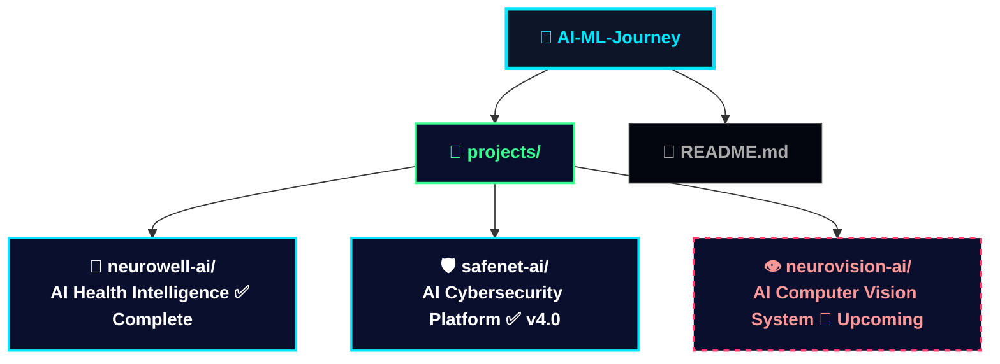

---

## 🚀 Projects

<div align="center">

| | Project | Status | One Line |
|--|---------|:------:|----------|
| 🧠 | **NeuroWell AI** | `✅ Complete` | AI-powered personal health intelligence — 100% local |
| 🛡️ | **SafeNet AI** | `✅ v4.0 Live` | AI cybersecurity SOC — real-time threat detection & SOAR |
| 👁️ | **NeuroVision AI** | `🔄 Upcoming` | AI computer vision — object detection, emotion, anomaly |

</div>

---

## 🧠 Project 1 — NeuroWell AI

<div align="center">


</div>

> **A full-stack AI personal health intelligence system — 100% in-browser, no cloud, no server, fully private.**

### 💡 The Core Idea

<div align="center">

```
Most health apps just track numbers.
They don't understand you, talk to you, or remember you.
NeuroWell is different.
```

| Without NeuroWell | With NeuroWell |
|:-----------------:|:--------------:|
| ❌ Just a number tracker | ✅ Talks to you via AI chat |
| ❌ Forgets everything | ✅ Remembers your health history |
| ❌ Ignores your mood | ✅ Detects emotion in real-time |
| ❌ Generic advice | ✅ Personalized AI recommendations |
| ❌ Cloud dependent | ✅ 100% local — data never leaves |

</div>

> 💡 Think of it as a **personal AI doctor friend** — always available, always private.

### 🔁 How NeuroWell Works

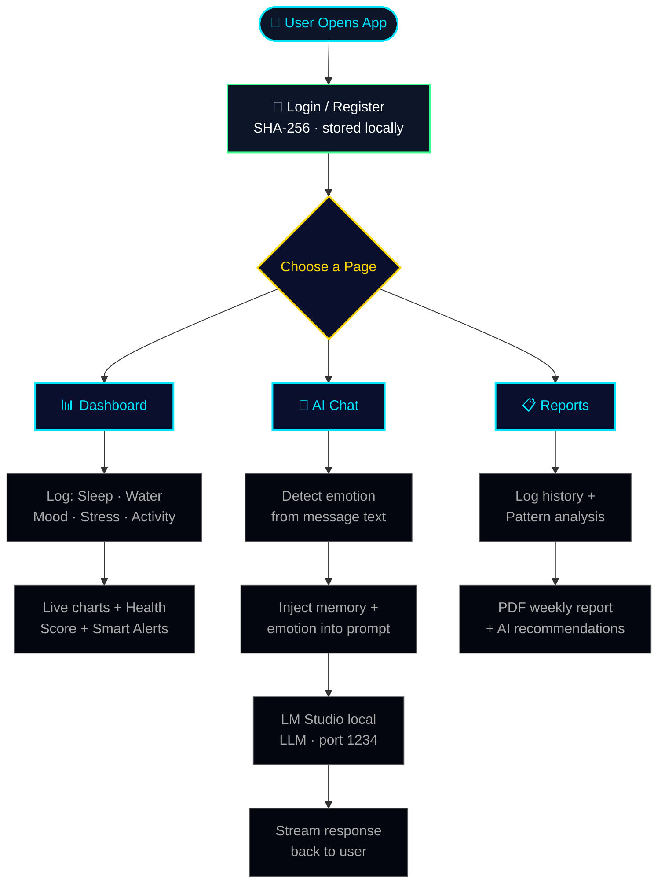

### ✨ Features

<div align="center">

| # | Feature | What It Does |
|:-:|---------|-------------|
| 01 | 🤖 **Local AI Chat** | Streams LM Studio responses live about your health |
| 02 | 🧠 **Long-term Memory** | Saves & injects past symptoms/goals into every prompt |
| 03 | 😰 **Emotion Detection** | Detects mood from text — adapts AI tone accordingly |
| 04 | 🎙️ **Voice I/O** | Web Speech API input · Speech Synthesis output |
| 05 | 📊 **Health Dashboard** | Chart.js charts for sleep, water, mood, stress |
| 06 | 🔍 **Pattern Detection** | 10+ rules catch risky health trends automatically |
| 07 | 📄 **PDF Reports** | jsPDF weekly health summary with AI recommendations |
| 08 | 🔐 **Secure Auth** | SHA-256 via Web Crypto API + session route guards |
| 09 | 📱 **PWA + Offline** | Service Worker — works offline, installable |

</div>

### 😰 Emotion Detection Flow

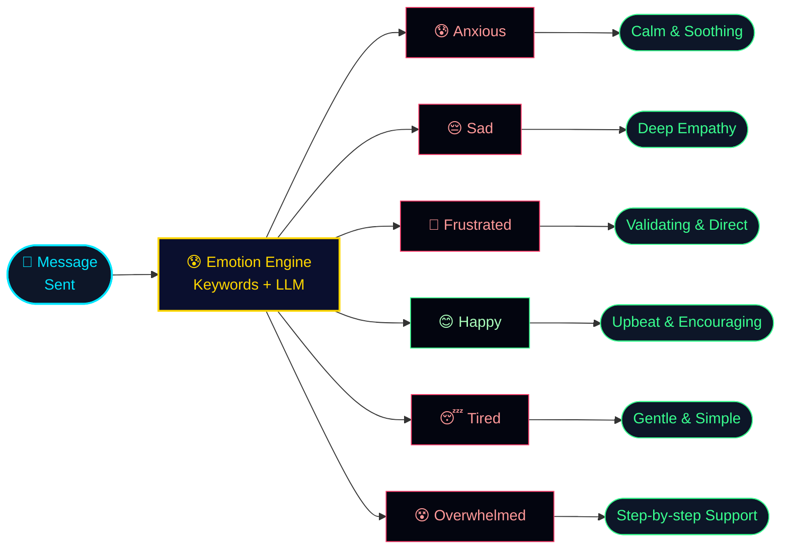

### 🔍 Pattern Detection Engine

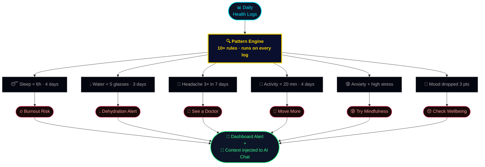

### 🔐 Privacy Architecture

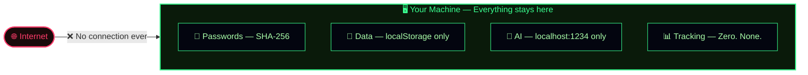

### ⚡ Quick Start

```bash
git clone https://github.com/Jags-08/neurowell.git
cd neurowell
open index.html   # No install. No API keys. Just open and go.
```

> ✅ **No npm. No backend. No API keys needed.** Open `index.html` — it works.

### 🗺️ NeuroWell Roadmap

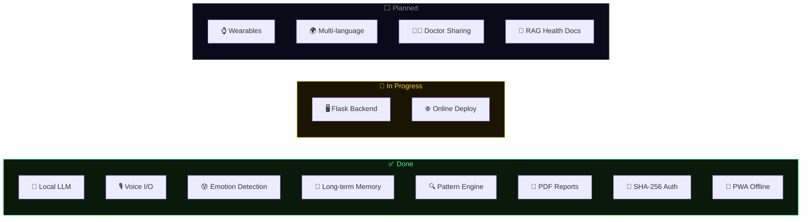

---

## 🛡️ Project 2 — SafeNet AI

<div align="center">


</div>

> **A fully local AI cybersecurity platform — real-time threat detection, automated SOAR response, and a security-locked LLM copilot. 10 modules. Zero cloud.**

### 💡 The Problem It Solves

<div align="center">

| Without SafeNet AI | With SafeNet AI |
|:-----------------:|:--------------:|
| ❌ Logs unreadable at scale | ✅ AI scans thousands of events instantly |
| ❌ Threats hide in patterns | ✅ ML detects anomalies automatically |
| ❌ Alerts after damage is done | ✅ Detection + auto-block in < 200ms |
| ❌ Requires a security team | ✅ SOAR automates response — zero latency |
| ❌ No private AI option | ✅ 100% local — your data never leaves |

</div>

### 🔁 System Architecture

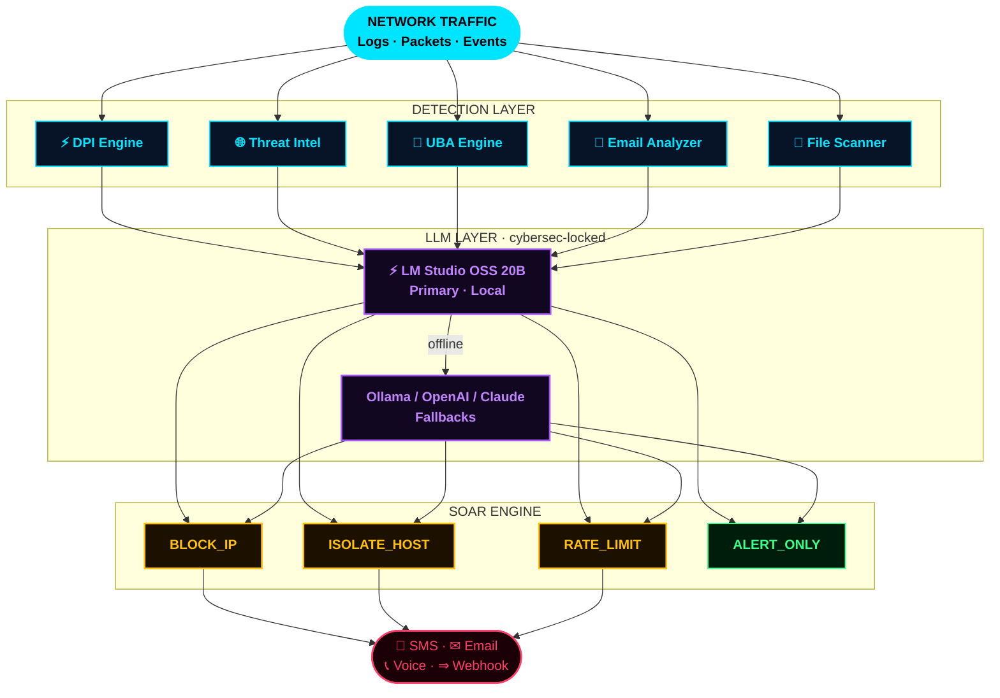

### ✨ 10 Modules

<div align="center">

| # | Module | What It Does |
|:-:|--------|-------------|
| 01 | ⚡ **DPI Engine** | Full payload inspection — SQLi, XSS, C2, reverse shells |
| 02 | 🤖 **LLM Analysis** | LM Studio 20B — cybersec-locked · temp 0.12 |
| 03 | 📧 **Email Analyzer** | NLP phishing — SPF/DKIM/DMARC · domain spoof · AI-gen detect |
| 04 | 🌐 **IP Intelligence** | Geo · TOR/VPN/proxy detection · reputation 0–100 |
| 05 | 👤 **UBA Engine** | Insider threats — off-hours, bulk downloads, geo velocity |
| 06 | 🔥 **SOAR Engine** | 6 auto-rules · LLM-confirmed for CRITICAL actions |
| 07 | 📁 **File Scanner** | Shannon entropy · hash DB · double extension · signatures |
| 08 | 🧠 **AI Copilot** | Security-locked RAG assistant — 100% local |
| 09 | 🚨 **Alert Channels** | SMS · Email · Voice Call · Webhook — per severity |
| 10 | 📊 **Dashboard** | WebSocket real-time stream · Dark/Light mode |

</div>

### ⚡ LLM Priority Chain

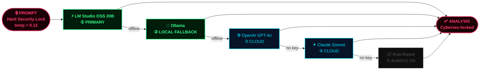

### 🔥 SOAR In Action

<div align="center">

| Trigger | Rule | Action | Dispatch |
|---------|:----:|--------|----------|
| 847 SSH failures · 60s | `R003` | BLOCK_IP ✓ LLM | SMS + Email |
| C2 beacon port 4444 | `R001` | BLOCK + ISOLATE | SMS + Voice |
| HTTP flood 12,400 req/s | `R002` | RATE_LIMIT | Email + Webhook |
| EternalBlue SMB exploit | `R006` | ISOLATE_HOST ✓ | SMS + Voice |
| SQL injection detected | `R005` | ALERT_ONLY | Webhook → SIEM |
| Phishing · score 94/100 | `AUTO` | QUARANTINE | SMS + Email |
| File entropy 7.8 · .pdf.exe | `AUTO` | QUARANTINE | Email |
| New-country login + VPN | `UBA` | SESSION_KILL | SMS |

</div>

### ⚡ Quick Start

```bash
git clone https://github.com/Jags-08/safenet-ai.git
cd safenet-ai
pip install flask flask-socketio flask-cors python-dotenv requests twilio sendgrid gevent
cp .env.example .env    # Add your Twilio/SendGrid keys (optional)
python main.py
```

```
╔═══════════════════════════════════════════════════╗
║  Dashboard  →  http://localhost:5000              ║
║  LLM Panel  →  http://localhost:5000/llm          ║
╚═══════════════════════════════════════════════════╝
```

> ✅ LM Studio handles the AI. Everything else is zero-config.

### 🗺️ SafeNet AI Roadmap

<div align="center">

| Status | Feature |
|:------:|---------|
| ✅ | Real-time WebSocket threat stream · 10 modules |
| ✅ | LM Studio OSS 20B integration (OpenAI-compatible) |
| ✅ | LLM fallback chain → Ollama → OpenAI → Claude |
| ✅ | SOAR automation · 6 rules · LLM-confirmed actions |
| ✅ | DPI · Email NLP · IP Intel · UBA · File Scanner |
| ✅ | SMS + Email + Voice + Webhook · Dark/Light mode |
| ✅ | XAI explainability · Executive report generator |
| 🔄 | Live packet sniffing (Scapy) |
| 🔄 | ML anomaly prediction (Isolation Forest + XGBoost) |
| ⬜ | Attack map geo-visualization |
| ⬜ | Mobile app · Multi-user SOC panel |
| ⬜ | MISP/OTX feeds · SIEM connectors |

</div>

---

## 👁️ Project 3 — NeuroVision AI

<div align="center">


</div>

> **An AI computer vision system — object detection, emotion recognition, anomaly detection, and multi-modal understanding. Real-time. Adaptive. Local.**

### 💡 The Problem It Will Solve

<div align="center">

| Without NeuroVision AI | With NeuroVision AI |
|:----------------------:|:-------------------:|
| ❌ Visual data interpreted manually | ✅ AI analyzes frames in real-time |
| ❌ Static rules miss context | ✅ Neural networks continuously learn & adapt |
| ❌ Single-source analysis | ✅ Multi-modal: vision + text + sensor data |
| ❌ High false-positive rate | ✅ Behavioral baseline reduces false alarms |
| ❌ Requires expert setup | ✅ Modular, customizable, no deep expertise |

</div>

### 🔁 Planned System Flow

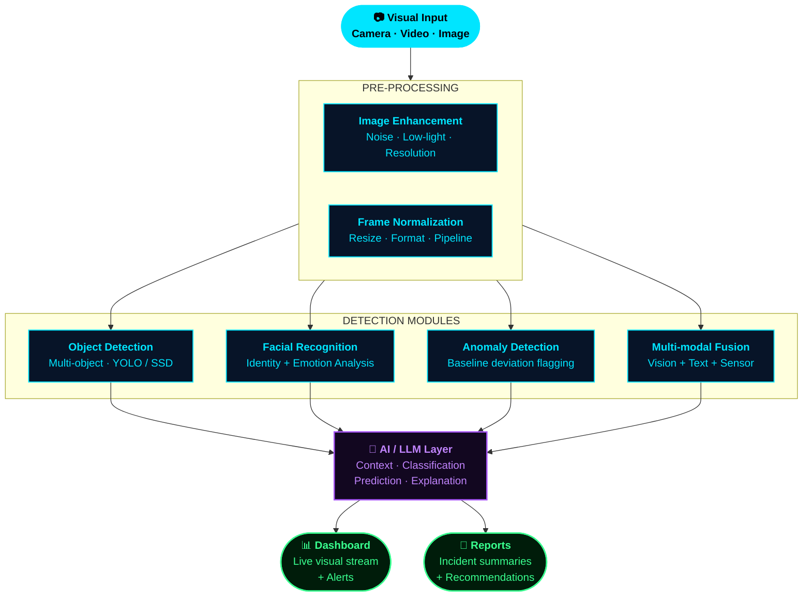

### ✨ Planned Modules

<div align="center">

| # | Module | What It Does | Tech |
|:-:|--------|-------------|------|
| 01 | 🎯 **Object Detection** | Detect + track multiple objects in real-time frames | YOLOv8 · SSD |
| 02 | 😊 **Emotion Analysis** | Recognize faces + classify emotional states | CNN · FER |
| 03 | 🚨 **Anomaly Detection** | Learn "normal" — flag deviations automatically | Autoencoder |
| 04 | 🌐 **Multi-modal Fusion** | Combine vision + text + sensor for deep context | Transformer |
| 05 | 🔧 **Image Enhancement** | Fix poor lighting, noise, low-res before inference | OpenCV |
| 06 | 📊 **Visual Dashboard** | Live frame analysis with overlay + alert stream | Chart.js |
| 07 | 🔐 **Privacy Controls** | Face anonymization + access control | On-device |

</div>

### 🔁 Detection Intelligence Flow

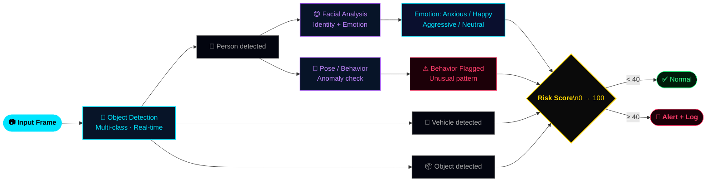

### 🛠️ Planned Tech Stack

<div align="center">

| Layer | Technology |
|-------|------------|
| **Language** | Python |
| **Vision Models** | YOLOv8 · OpenCV · MediaPipe |
| **Deep Learning** | PyTorch · TensorFlow · CNNs |
| **Face/Emotion** | DeepFace · FER · dlib |
| **Anomaly** | Autoencoders · Isolation Forest |
| **Multi-modal** | CLIP · Vision Transformers |
| **Dashboard** | Chart.js · WebSocket stream |
| **Privacy** | On-device inference · Anonymization |

</div>

### 🗺️ NeuroVision AI Roadmap

<div align="center">

| Status | Feature |
|:------:|---------|
| ⬜ | Real-time object detection + multi-object tracking |
| ⬜ | Facial recognition + emotion classification |
| ⬜ | Behavioral anomaly detection with learned baseline |
| ⬜ | Image enhancement pipeline (low-light, noise, blur) |
| ⬜ | Multi-modal fusion — vision + text + sensor |
| ⬜ | Live visual dashboard + alert stream |
| ⬜ | Privacy controls — face blur + access gating |
| ⬜ | Incident report generation with AI summaries |
| ⬜ | Edge deployment (Raspberry Pi / Jetson Nano) |
| ⬜ | Integration with SafeNet AI (visual threat layer) |

</div>

> 📅 Development starts next — ⭐ star this repo to follow the build.

---

## 🛠️ Overall Tech Stack

<div align="center">


<br/><br/>

| Category | Tools |
|:--------:|-------|
| **Languages** | Python · JavaScript · HTML · CSS |
| **Data & Math** | NumPy · Pandas · Matplotlib |
| **ML** | Scikit-learn · Isolation Forest · Random Forest |
| **Deep Learning** | TensorFlow · PyTorch · CNNs |
| **Computer Vision** | OpenCV · YOLOv8 · DeepFace |
| **AI / LLM** | LM Studio · OpenAI-compatible API · SSE Streaming |
| **Visualization** | Chart.js · Mermaid |
| **Reports** | jsPDF |
| **Security** | Web Crypto API (SHA-256) |
| **PWA** | Service Workers · Web App Manifest |
| **Voice** | Web Speech API · Speech Synthesis |

</div>

---

## 🎯 Goals of This Repository

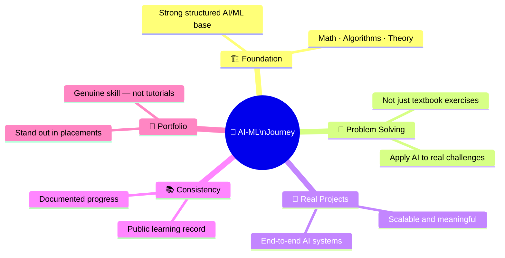

---

## ⚡ Getting Started

```bash
# Clone the full repository
git clone https://github.com/Jags-08/AI-ML-Journey.git
cd AI-ML-Journey

# NeuroWell AI (no install needed)
cd projects/neurowell-ai && open index.html

# SafeNet AI
cd projects/safenet-ai
pip install -r requirements.txt
cp .env.example .env && python main.py
```

---

## 🤝 Feedback & Suggestions

If you spot a bug, have a feature idea, or want to discuss AI/ML — open an issue or reach out directly. I'm learning in public and every insight that improves this repository is appreciated.

---

## ⭐ Support

<div align="center">

If this repository helps you — whether learning AI, building something similar, or just exploring — consider giving it a ⭐

**It keeps me motivated to keep building and sharing.**

</div>

---

## 👨‍💻 Author

<div align="center">

<a href="https://github.com/Jags-08">
  
</a>
&nbsp;
<a href="https://www.linkedin.com/in/joshi-jagrut">
  
</a>
&nbsp;
<a href="mailto:jagrutjoshi02@gmail.com">
  
</a>

<br/><br/>

**Jagrut Joshi · B.Tech Computer Science · DY Patil International University, Pune**

<br/>


<br/>

*"Mastery in AI doesn't come from reading about it. It comes from building with it."*

</div>

---

## ⚕️ Disclaimer

> **NeuroWell AI** is for informational and wellness purposes only. Not a substitute for professional medical advice. For emergencies, consult a licensed healthcare provider.

> **SafeNet AI** is for authorized security monitoring, research, and educational use only. Always obtain proper authorization before monitoring any network you don't own.

> **NeuroVision AI** (upcoming) will be subject to responsible AI and privacy-first design principles.

---

## 📜 License

```
MIT License — free to use, modify, and build upon.
See LICENSE file for details.
```

<br/>

<div align="center">


<sub>Built with obsession by <a href="https://github.com/Jags-08">Jagrut Joshi</a> · AI-ML Journey · Building intelligent systems that matter</sub>

</div>
