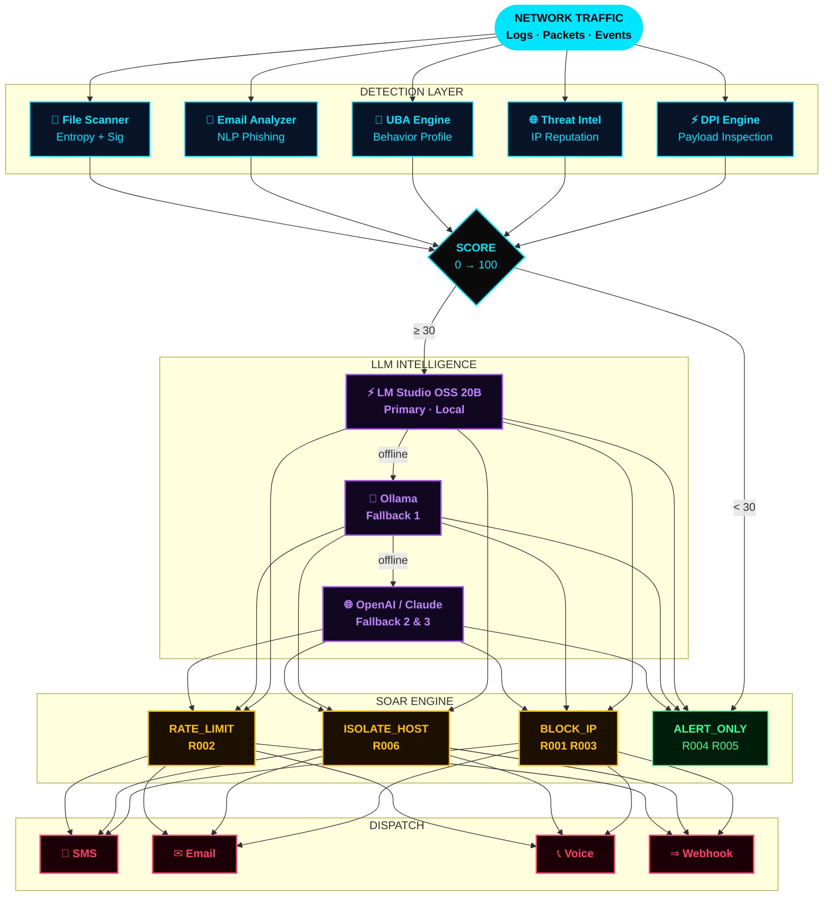
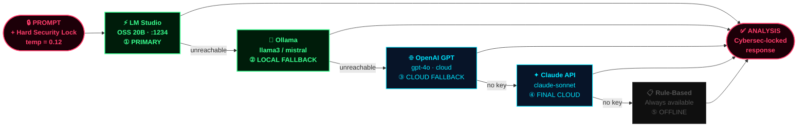
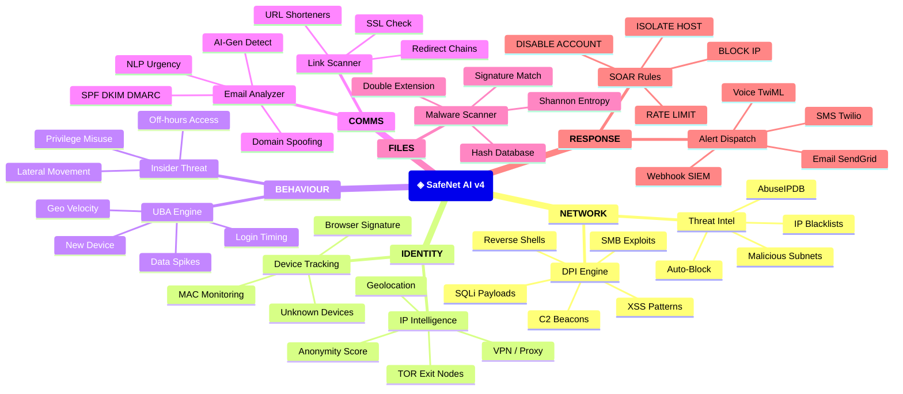
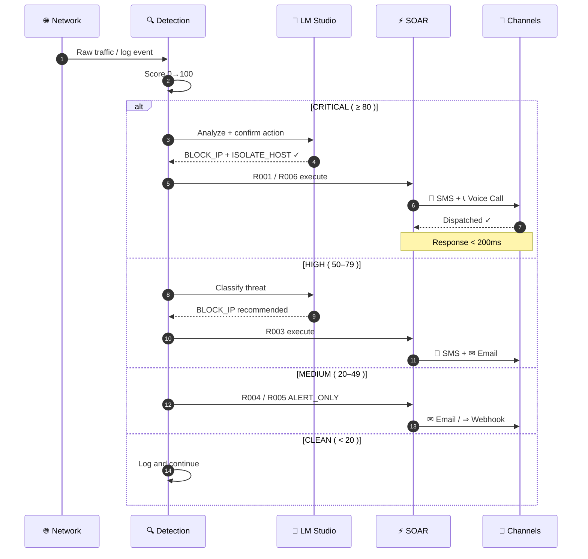
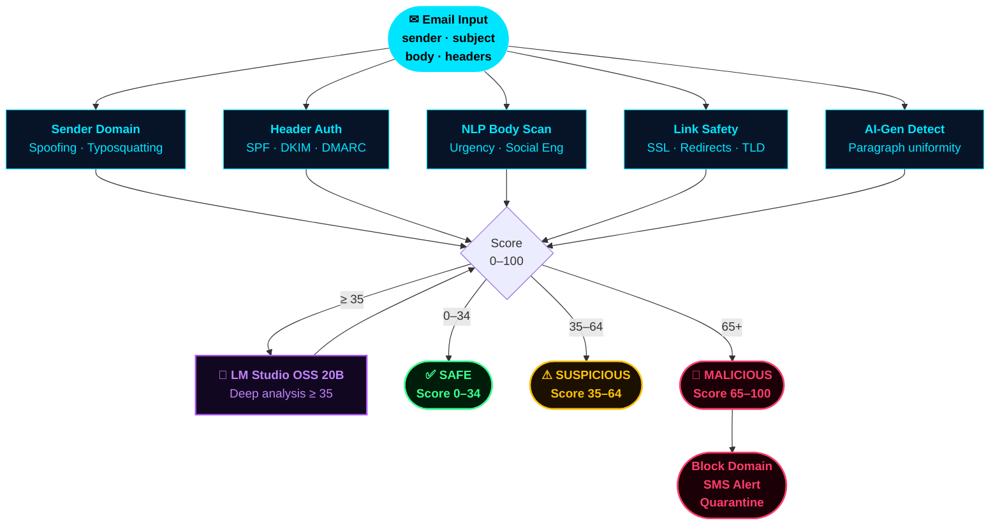

<div align="center">


</div>

<div align="center">

**AI-Powered Cybersecurity Intelligence Platform · Real-time · Local · Private · Automated**

</div>

<br/>

<p align="center">
  
</p>

<br/>

<div align="center">


<br/>


</div>

<br/>

---

## 〔 01 〕 WHAT IS SAFENET AI?


**SafeNet AI v4** is a next-generation, **fully local** cybersecurity intelligence platform. It runs entirely on your machine — no cloud, no subscriptions, no data egress.

Your **LM Studio OSS 20B model** acts as the intelligence brain, permanently locked to cybersecurity analysis through a hardened system prompt. It cannot drift, cannot hallucinate off-topic, cannot be redirected to unrelated questions.

```python
safenet = {
    "type"      : "AI-Powered SOC Platform",
    "version"   : "v4.0",
    "llm"       : "LM Studio OSS 20B (OpenAI-compatible API)",
    "modules"   : 10,
    "rules"     : 6,           # SOAR auto-response rules
    "alerts"    : ["SMS", "Email", "Voice Call", "Webhook"],
    "latency"   : "< 200ms",  # threat to response
    "cloud"     : 0,
    "egress"    : "Never",
    "control"   : "100% yours",
}
```

> 🛡 Think of it as your **private AI-powered SOC** — detecting, classifying, and containing threats before you even read the alert.

<br clear="right"/>

---

## 〔 02 〕 LIVE CONSOLE

> v4.0 · Threat Command Centre · 10 Modules · 6 SOAR Rules · ARMED

| Time | Level | Event |
|------|:-----:|-------|
| 09:14:03 | `BOOT` | System online · LM Studio connected ✓ · 10 modules active |
| 09:14:07 | ⚠ `WARN` | IP 185.234.xx.xx · TOR exit node confirmed · Score: 92 |
| 09:14:09 | 🔴 `CRIT` | SSH brute force · 847 failures in 60s → IP BLOCKED |
| 09:14:11 | 🔴 `CRIT` | C2 beacon port:4444 → known infra → SOAR: ISOLATE_HOST |
| 09:14:13 | ⚠ `WARN` | Unknown MAC: DE:AD:BE:EF:00:21 · Unauthorized device |
| 09:14:15 | 🔴 `CRIT` | Phishing: paypa1-verify.ru flagged MALICIOUS · Score: 94 |
| 09:14:17 | 🤖 `AI` | LLM analysis complete · 3 classified · 2 IPs blocked |
| 09:14:19 | ✅ `OK` | SMS dispatched · PDF report ready · SOAR: 4 actions run |

---

## 〔 03 〕 SYSTEM ARCHITECTURE



---

## 〔 04 〕 LLM PRIORITY CHAIN



---

## 〔 05 〕 MODULE MAP



---

## 〔 06 〕 SOAR RESPONSE FLOW



---

## 〔 07 〕 EMAIL ANALYZER FLOW



---

## 〔 08 〕 CORE MODULE TABLE

<div align="center">

| ◈ | Module | Detection Method | Output | Severity |
|:-:|--------|-----------------|--------|:--------:|
| `01` | ⚡ **DPI Engine** | Payload regex · Signature DB · Protocol anomaly | Attack type + CVE ref | `CRITICAL` |
| `02` | 🤖 **LLM Analysis** | LM Studio 20B · Locked system prompt | Natural language verdict | `ALL` |
| `03` | 📧 **Email Analyzer** | NLP · SPF/DKIM · Domain spoof · AI-gen detect | `SAFE / SUSPICIOUS / MALICIOUS` | `0–100` |
| `04` | 🌐 **IP Intelligence** | ip-api · TOR list · ASN · AbuseIPDB | Reputation + anonymity label | `0–100` |
| `05` | 👤 **UBA Engine** | Behavioral baseline · Time · Volume · Device · Geo | `INSIDER / COMPROMISED / DEVIATION` | `HIGH` |
| `06` | 🔥 **SOAR Engine** | 6 auto-rules · LLM confirmation on CRITICAL | Action + audit log | `Instant` |
| `07` | 📁 **File Scanner** | Shannon entropy · MD5/SHA256 · Signature scan | `CLEAN / SUSPICIOUS / MALICIOUS` | `0–100` |
| `08` | 🧠 **AI Copilot** | RAG context · LM Studio local · locked scope | Threat explanation + action rec | `Contextual` |
| `09` | 🚨 **Alert Channels** | Threshold routing · Severity filter | SMS · Email · Voice · Webhook | `Per severity` |
| `10` | 📊 **Dashboard** | WebSocket stream · Chart.js · Dark/Light mode | Live threat command centre | `Real-time` |

</div>

---

## 〔 09 〕 SCREENSHOTS

### 📊 Dashboard — Dark Mode


<br/>

### 🌞 Dashboard — Light Mode


<br/>

### 🧠 AI Security Copilot


<br/>

### ⚡ SOAR Audit Log & Automated Response


<br/>

### 👤 User Behavior Analytics


<br/>

### 🌐 IP Intelligence & Threat Blacklist


<br/>

### 📧 Email Analyzer — Phishing Detection


<br/>

### 🚨 Critical Alert Action Modal


<br/>

### 📡 Alert Channel Configuration


---

## 〔 10 〕 PROJECT STRUCTURE

```
safenet-ai/
│
├── 🚀  main.py                  ◄─── Entry point
├── ⚙️   requirements.txt
├── 🔐  .env.example             ◄─── Copy → .env
│
├── config/
│   └── ⚙️   settings.py         ◄─── All env config
│
├── backend/
│   ├── 🏭  app.py               ◄─── Flask + SocketIO
│   │
│   ├── services/
│   │   ├── 🧠  llm_service.py   ◄─── LM Studio + fallbacks
│   │   ├── 📦  log_generator.py ◄─── Synthetic events
│   │   ├── 🔍  threat_intel_service.py
│   │   ├── 🌐  ip_intelligence_service.py
│   │   ├── 📧  email_analyzer_service.py
│   │   ├── 👤  uba_service.py
│   │   ├── ⚡  soar_service.py  ◄─── 6 auto-response rules
│   │   ├── 📁  file_scanner_service.py
│   │   ├── 📱  sms_service.py   ◄─── Twilio SMS
│   │   ├── ✉️   email_service.py ◄─── SendGrid
│   │   └── 📞  call_service.py  ◄─── Twilio Voice/TwiML
│   │
│   └── routes/
│       ├── 🚨  alerts.py        ◄─── /api/alerts/*
│       ├── 📡  channels.py      ◄─── /api/channels/*
│       ├── 🔬  analysis.py      ◄─── /api/analysis/* (LLM)
│       └── 🌐  intelligence.py  ◄─── /api/intel/*
│
├── frontend/
│   ├── 📊  index.html           ◄─── Dashboard (8 tabs)
│   └── ⚡  llm.html             ◄─── LLM engine panel
│
└── data/cache/                  ◄─── In-memory event store
```

---

## 〔 11 〕 TECH STACK

<div align="center">


<br/><br/>

| Layer | Technology | Role |
|-------|------------|------|
| **Backend** | Python 3.11 · Flask · Flask-SocketIO | Server · WebSocket · REST API |
| **Frontend** | HTML5 · CSS3 · Vanilla JS | 8-tab dashboard · Dark/Light |
| **LLM ①** | LM Studio · OSS 20B (OpenAI API compat) | Local threat intelligence |
| **LLM ②** | Ollama — llama3 / mistral / phi3 | Local model fallback |
| **LLM ③** | OpenAI GPT-4o · Claude Sonnet | Cloud fallbacks |
| **Threat Intel** | ip-api.com · AbuseIPDB | IP enrichment (free tier) |
| **Alerting** | Twilio SMS · Twilio Voice · SendGrid | Dispatch channels |
| **Visualization** | Chart.js · SSE streaming | Live charts |
| **Auth** | Web Crypto API · SHA-256 | Credential hashing |
| **Packets** | Scapy (DPI) | Payload inspection |

</div>

---

## 〔 12 〕 QUICKSTART

### `[01]` Clone

```bash
git clone https://github.com/Jags-08/safenet-ai.git
cd safenet-ai
```

### `[02]` Install

```bash
pip install flask flask-socketio flask-cors python-dotenv \
            requests twilio sendgrid gevent gevent-websocket
```

### `[03]` Setup LM Studio

1. Download → https://lmstudio.ai
2. Load your OSS 20B GGUF model inside LM Studio
3. Open **Local Server** tab in the left sidebar
4. Enable CORS → Allow all origins ✓
5. Click **Start Server** → running on `http://localhost:1234`

> SafeNet auto-detects your model name via `/v1/models`

### `[04]` Configure `.env`

```bash
cp .env.example .env
```

```env
# ── Required ──────────────────────────
LM_STUDIO_URL=http://localhost:1234
LM_STUDIO_MODEL=auto
LLM_MODE=auto

# ── Optional: SMS & Voice ──────────────
TWILIO_ACCOUNT_SID=ACxxxxxxxxxxxxxxxx
TWILIO_AUTH_TOKEN=your_token
TWILIO_FROM_NUMBER=+1XXXXXXXXXX
SMS_RECIPIENT=+91XXXXXXXXXX

# ── Optional: Email ────────────────────
SENDGRID_API_KEY=SG.xxxxxxxxx
EMAIL_FROM=safenet@yourdomain.com
EMAIL_TO=security@company.com
```

### `[05]` Launch

```bash
python main.py
```

Once running, open your browser:

| Interface | URL |
|-----------|-----|
| 📊 Dashboard | http://localhost:5000 |
| 🧠 LLM Panel | http://localhost:5000/llm |
| 📖 API Docs | http://localhost:5000/api |

---

## 〔 13 〕 SOAR IN ACTION

| Trigger | Rule | Action | Dispatch |
|---------|:----:|--------|----------|
| 847 SSH failures in 60s | `R003` | BLOCK_IP ✓ LLM | SMS + Email |
| C2 beacon port 4444 → known infra | `R001` | BLOCK + ISOLATE | SMS + Voice Call |
| HTTP flood 12,400 req/s | `R002` | RATE_LIMIT | Email + Webhook |
| EternalBlue SMB · MS17-010 | `R006` | ISOLATE_HOST ✓ | SMS + Voice Call |
| SQL injection UNION SELECT | `R005` | ALERT_ONLY | Webhook → SIEM |
| Port scan 1–65535 detected | `R004` | ALERT_ONLY | Email |
| Phishing: paypa1.com · score 94 | `AUTO` | QUARANTINE | SMS + Email |
| File entropy 7.8 · .pdf.exe | `AUTO` | QUARANTINE | Email |
| New-country login + VPN | `UBA` | SESSION_KILL | SMS |
| Bulk download 11× baseline 22:00 | `UBA` | INSIDER_ALERT | Email + Call |

---

## 〔 14 〕 API REFERENCE

**Alerts**

| Method | Endpoint | Description |
|--------|----------|-------------|
| `GET` | `/api/alerts/recent` | Last 50 threat events |
| `GET` | `/api/alerts/cache` | Full event cache |
| `GET` | `/api/alerts/stats` | Live system statistics |
| `DELETE` | `/api/alerts/cache` | Clear event cache |

**Channels**

| Method | Endpoint | Description |
|--------|----------|-------------|
| `POST` | `/api/channels/configure` | Enable / disable alert channel |
| `POST` | `/api/channels/test` | Send test SMS / email / call |
| `POST` | `/api/channels/dispatch` | Manual event dispatch |

**Analysis**

| Method | Endpoint | Description |
|--------|----------|-------------|
| `POST` | `/api/analysis/analyze` | Run LLM on threat batch |
| `POST` | `/api/analysis/copilot` | AI copilot chat |
| `GET` | `/api/analysis/status` | LLM health — all backends |
| `POST` | `/api/analysis/set-mode` | Switch LLM mode at runtime |
| `GET` | `/api/analysis/lmstudio/models` | List loaded LM Studio models |
| `POST` | `/api/analysis/lmstudio/stream` | Token-stream via SSE |

**Intelligence**

| Method | Endpoint | Description |
|--------|----------|-------------|
| `GET` | `/api/intel/ip/<ip>` | Full IP intelligence report |
| `GET` | `/api/intel/blacklist` | Blacklisted IPs |
| `POST` | `/api/intel/blacklist/add` | Add IP to blacklist |
| `POST` | `/api/intel/email/analyze` | Analyze email for phishing |
| `GET` | `/api/intel/soar/log` | SOAR audit log |
| `POST` | `/api/intel/soar/action` | Execute manual SOAR action |
| `GET` | `/api/intel/uba/profiles` | User behavioral profiles |
| `GET` | `/api/intel/uba/alerts` | UBA anomaly alerts |
| `POST` | `/api/intel/files/scan` | Upload file for malware scan |
| `POST` | `/api/intel/copilot/chat` | Ask the AI copilot |
| `POST` | `/api/intel/xai/explain` | Why was this threat flagged? |
| `GET` | `/api/intel/report/summary` | AI executive threat summary |

---

## 〔 15 〕 PRIVACY

```python
safenet_privacy = {
    "architecture"   : "Offline-first · local-only by default",
    "llm_inference"  : "localhost:1234 — never leaves your machine",
    "data_storage"   : "In-memory only — nothing written to disk",
    "cloud_calls"    : 0,
    "telemetry"      : False,
    "tracking"       : None,
    "data_sold"      : "Never",
    "control"        : "100% yours",
    "optional_egress": [
        "Twilio / SendGrid  — only if you configure them",
        "ip-api.com         — free IP geolocation, no auth",
        "AbuseIPDB          — only if ABUSEIPDB_KEY is set",
    ],
}
```

---

## 〔 16 〕 DESIGN SYSTEM

| Token | Hex | Usage |
|-------|:---:|-------|
| Background Void | `#000005` | Page background — deepest black |
| Surface | `#07070a` | Cards · Panels |
| **Cyber Cyan** | `#00E5FF` | Primary accent · KPIs · headings |
| **Neon Crimson** | `#FF1A36` | Critical threats — bright, immediate |
| **Neon Green** | `#39FF8F` | Safe · Clean · Online states |
| Warning Amber | `#FFC107` | HIGH severity · warnings |
| Royal Gold | `#C9A84C` | UI chrome · borders |
| Ice Blue | `#4A9EFF` | IP addresses · source data |

| Role | Font |
|------|------|
| Display | `Cormorant Garamond` — italic serif, authority |
| UI / Data | `IBM Plex Mono` — all values, logs, terminal |

---

## 〔 17 〕 ROADMAP

| Status | Feature |
|:------:|---------|
| ✅ | Real-time WebSocket threat stream |
| ✅ | AI email phishing detection (NLP + SPF/DKIM/DMARC) |
| ✅ | IP intelligence · VPN/TOR/proxy detection |
| ✅ | User Behavior Analytics (UBA) · insider threat |
| ✅ | SOAR automation · 6 rules · audit log |
| ✅ | File malware scanner (entropy + signatures) |
| ✅ | AI Security Copilot (local LLM · cybersec-locked) |
| ✅ | LM Studio OSS 20B integration (OpenAI-compatible) |
| ✅ | LLM fallback chain (LM Studio → Ollama → OpenAI → Claude) |
| ✅ | SMS + Email + Voice Call + Webhook alerts |
| ✅ | Dark / Light mode · in-app notification stack |
| ✅ | XAI Explainability module |
| ✅ | Executive threat report generator |
| ✅ | LLM management panel (/llm) · live model switching |
| 🔄 | Real-time packet sniffing (Scapy live capture) |
| 🔄 | ML anomaly prediction (Isolation Forest + XGBoost) |
| 🔄 | Attack map geo-visualization |
| ⬜ | Firewall rule auto-push |
| ⬜ | Mobile companion app (React Native) |
| ⬜ | Multi-user SOC admin panel |
| ⬜ | MISP / OTX threat intelligence feed integration |
| ⬜ | Dark web credential leak monitoring |
| ⬜ | AWS CloudWatch / Azure Sentinel integration |
| ⬜ | Splunk / Elastic SIEM native connector |

---

## 〔 18 〕 AUTHOR

<div align="center">

### Jagrut Joshi

**B.Tech Computer Science · DY Patil International University, Pune**

<br/>

<a href="https://github.com/Jags-08">
  
</a>
&nbsp;
<a href="https://www.linkedin.com/in/joshi-jagrut/">
  
</a>
&nbsp;
<a href="mailto:jagrutjoshi02@gmail.com">
  
</a>

<br/><br/>

> *"I build things that protect other things."*


<br/>

*If SafeNet AI helped you, a ⭐ goes a long way — thank you.*

</div>

---

## 〔 19 〕 LEGAL

> **SafeNet AI is built for authorized security monitoring, research, and educational use only.**
> Deep packet inspection and network monitoring tools may be subject to local and regional law.
> Always obtain written authorization before monitoring any network or system you do not own.
> The author accepts no liability for unauthorized or illegal use.

```
MIT License — free to use, modify, and distribute with attribution.
Copyright (c) 2025 Jagrut Joshi
```

---

<div align="center">


**◈ S A F E N E T   A I   v 4 . 0 · localhost:5000 · YOUR PRIVATE SOC ◈**

<sub>Built with obsession by <a href="https://github.com/Jags-08">Jagrut Joshi</a></sub>

</div>
