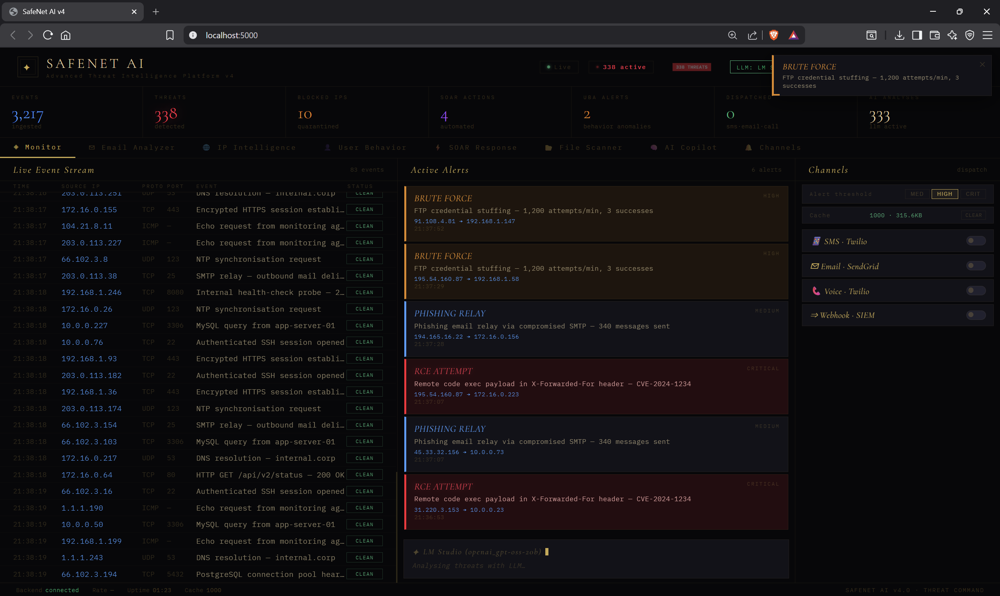
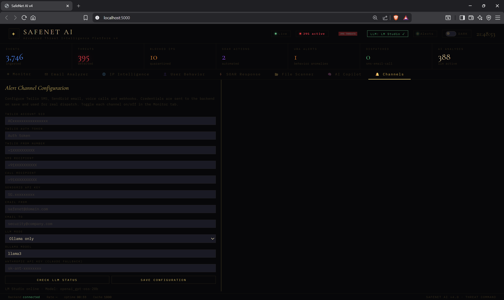

<div align="center">


</div>

<br/>

<p align="center">
  
</p>

<br/>

<p align="center">
  
  
  
  
  
</p>

<p align="center">
  
  
  
  
  
  
</p>

<br/>

<p align="center">
  
</p>

## 🛡️ What is SafeNet AI?


SafeNet AI v4 is a **next-generation cybersecurity intelligence platform** that operates entirely **locally**, combining Deep Packet Inspection, AI-powered threat reasoning, real-time dashboards, and automated SOAR response — all without a single byte leaving your machine.

It connects to your **local LLM via LM Studio** (OpenAI-compatible API) to give you a security-aware AI copilot that **analyzes your logs**, **explains attacks**, **detects phishing**, and **automates incident response** — all while monitoring your network, devices, and traffic with live visual dashboards.

> 💡 Think of it as your **AI-powered SOC (Security Operations Center)** — running locally, privately, and intelligently. No cloud. No compromise.

<br clear="right"/>

<p align="center">
  
</p>

## 📡 Live Console Preview

```
09:14:03  [OK]     System initialized · 10 detection modules loaded
09:14:07  [WARN]   IP 185.234.xx.xx · VPN detected · Risk score: 72
09:14:09  [ALERT]  Brute-force attempt · 14 failed logins in 30s · IP blocked
09:14:11  [WARN]   Unknown MAC: DE:AD:BE:EF:00:21 · Unauthorized device
09:14:13  [ALERT]  Phishing email detected · fake-bank-login.ru flagged
09:14:15  [OK]     AI threat report generated · 3 incidents · PDF ready
```

<p align="center">
  
</p>

## ⚡ Core Features

<div align="center">

| # | Feature | Description | Tech |
|---|---------|-------------|------|
| 01 | 🔍 **DPI Engine** | Inspects packet payloads — not just headers | Scapy · Python |
| 02 | 🤖 **AI Threat Analysis** | LLM-based contextual attack classification | LM Studio · OpenAI API |
| 03 | 📩 **Email Analyzer** | Phishing detection using NLP + context scoring | NLP · Rules Engine |
| 04 | 🌐 **IP Intelligence** | Reputation scoring, VPN detection, geo-tracking | IP APIs · Heuristics |
| 05 | 🧠 **UBA Engine** | Detect insider threats & behavioral anomalies | ML · Pattern Analysis |
| 06 | ⚡ **SOAR Automation** | Automated incident response rules & actions | Event Engine |
| 07 | 📁 **File Scanner** | Entropy-based malware + signature detection | Shannon Entropy |
| 08 | 🧠 **AI Copilot** | Cybersecurity RAG assistant (on-device) | LM Studio · RAG |
| 09 | 🚨 **Alerts System** | SMS, Email, Voice calls, Webhooks | Twilio · SendGrid |
| 10 | 📊 **Dashboard** | Real-time visual threat monitoring | Chart.js · WebSockets |

</div>

<br/>

### 🔍 Deep Packet Inspection (DPI)
Unlike traditional firewalls, SafeNet analyzes the full packet payload:
- **SQL Injection (SQLi)** — Pattern matching at the payload level
- **Cross-Site Scripting (XSS)** — Script tag & encoding attack detection
- **Command & Control (C2)** — Beacon pattern & callback detection
- **Reverse Shell Attempts** — Port + payload heuristics

```
MEDIUM   → Recon activity
HIGH     → Active exploitation
CRITICAL → Breach / ransomware
```

### 📩 Email Analyzer (AI Phishing Detection)
LLM-based NLP instead of basic spam filters — detects:
- Urgency manipulation & CEO impersonation
- Fake links & domain spoofing
- Financial fraud language patterns
- OTP & banking scam templates

```
Output: SAFE / SUSPICIOUS / MALICIOUS
```

### 🌐 IP Intelligence System
Every IP analyzed across multiple enrichment layers:
- Geolocation + ISP routing data
- VPN / TOR / proxy detection
- Reputation score (0–100)
- **Impossible travel** login detection
- Suspicious datacenter traffic flagging

### 🧠 User Behavior Analytics (UBA)
Detects **internal threats & compromised accounts** by monitoring:
- Login timing anomalies & after-hours access
- Data access spikes & bulk downloads
- Lateral movement patterns
- Unusual workflow deviations

```
AI Classifications:
INSIDER_THREAT · COMPROMISED_ACCOUNT · NORMAL_DEVIATION
```

### ⚡ SOAR Automation Engine
SafeNet reacts **instantly** to threats without human intervention:

```
R001 → CRITICAL     → BLOCK_IP
R002 → DDoS         → RATE_LIMIT
R006 → SMB Exploit  → ISOLATE_HOST
```

Manual override controls: Block IP · Disable Account · Isolate Host · Alert-Only Mode

### 📁 File Scanner (Entropy-Based Malware)
Uses **Shannon Entropy** to detect obfuscation:
- Low entropy → Normal file
- High entropy → Packed / encrypted malware
- MD5 / SHA-256 hash verification
- Signature anomaly detection

### 🧠 AI Copilot (Cybersecurity Assistant)
The most powerful feature 🔥 — context-aware, on-device, RAG-powered:
- Ask: *"Is this log suspicious?"* or *"Explain this attack pattern"*
- Smart context injection: active threats, event counts, attack history
- Cybersecurity-scoped responses — no hallucination drift
- 100% local — your logs never leave your machine

<p align="center">
  
</p>

## 📸 Screenshots

### 📊 Dashboard (Dark Mode)


### 🌞 Dashboard (Light Mode)


### 🤖 AI Copilot


### ⚡ SOAR Audit Log & Response


### 🧠 User Behavior Analytics (UBA)


### 🌐 IP Intelligence & Threat Blacklist


### 📩 Email Analyzer (Phishing Detection)


### 🚨 Alert Actions (Critical Response)


### 📡 Channels & Alert Configuration


<p align="center">
  
</p>

## 📁 Project Structure

```
safenet-ai/
│
├── 📄 app.py                     ← Flask backend entry point
├── 🔌 socket.py                  ← WebSocket real-time handler
├── 🧠 ai_engine.py               ← LLM interaction + RAG context
├── ⚙️  threat_engine.py          ← Core detection rules pipeline
│
├── templates/
│   ├── 📄 index.html             ← Login / Landing page
│   └── 📊 dashboard.html         ← Threat monitoring dashboard
│
├── static/
│   ├── css/
│   │   ├── 🎨 main.css           ← Design system (dark cyber theme)
│   │   └── 📊 dashboard.css      ← Chart & alert panel styles
│   └── js/
│       ├── 🔐 auth.js            ← Auth + SHA-256 hashing
│       ├── 📋 logs.js            ← Log parsing engine
│       ├── ⚡ threat-engine.js   ← Core AI detection
│       ├── 🌐 ip-analyzer.js     ← IP intelligence layer
│       ├── 📩 fraud-detection.js ← Fraud & spam engine
│       ├── 🧠 llm-chat.js        ← AI copilot interface
│       └── 📊 dashboard.js       ← Chart.js + live alerts
│
└── utils/
    ├── 🌐 ip_analysis.py         ← IP enrichment + reputation
    ├── 📁 file_scan.py           ← Entropy-based malware scan
    └── 📩 email_analyzer.py      ← NLP phishing detection
```

<p align="center">
  
</p>

## 🛠️ Tech Stack

<div align="center">

**💻 Core Languages**


<br/><br/>

**🤖 AI & LLM**


&nbsp;

&nbsp;

&nbsp;


<br/><br/>

**🔌 Real-time**


&nbsp;

&nbsp;


<br/><br/>

**📊 Visualization & Reports**


&nbsp;


<br/><br/>

**🚨 Alerting**


&nbsp;

&nbsp;


<br/><br/>

| Layer | Technology |
|-------|------------|
| Backend | Python · Flask · WebSockets |
| Frontend | HTML5 · CSS3 · JavaScript |
| AI / LLM | LM Studio · OpenAI-compatible API |
| Packet Analysis | Scapy · DPI Engine |
| Visualization | Chart.js |
| Reports | jsPDF |
| Auth | Web Crypto API · SHA-256 |
| Alerting | Twilio · SendGrid · Webhooks |

</div>

<p align="center">
  
</p>

## ⚡ Quick Start

### 1️⃣ Clone the Repository

```bash
git clone https://github.com/Jags-08/safenet-ai.git
cd safenet-ai
```

### 2️⃣ Install Dependencies

```bash
pip install flask flask-socketio scapy requests
```

### 3️⃣ Set Up LM Studio

```
1. Download LM Studio → https://lmstudio.ai
2. Load any OpenAI-compatible model (e.g. GPT-4o OSS 20B)
3. Go to Local Server tab
4. Enable CORS → Allow all origins
5. Click "Start Server" on port 1234
```

### 4️⃣ Run the Backend

```bash
python app.py
```

### 5️⃣ Open the Dashboard

```
http://localhost:5000
```

> ✅ **No cloud keys. No external dependencies. No data egress.** Fully local from day one.

<p align="center">
  
</p>

## 🚨 SOAR Automation in Action

SafeNet automatically responds to threats the moment they're detected:

```
⚡ "14 failed logins in 30s from 185.234.x.x      → IP auto-blocked"
🌍 "Login from new country (RU) + VPN detected    → Session terminated"
📩 "fake-bank-login.ru in email body              → Marked MALICIOUS, quarantined"
💻 "Unknown MAC DE:AD:BE:EF:00:21 on network      → Device flagged + admin alerted"
📊 "Traffic spike 4x baseline from single source  → Rate limited + DDoS alert"
🔐 "Entropy 7.8 detected in uploaded .exe file    → Quarantined, AI analysis triggered"
```

<p align="center">
  
</p>

## 🔐 Security & Privacy

```python
security = {
    "mode"         : "Fully local — offline-first",
    "data"         : "No cloud transfer. Ever.",
    "ai_inference" : "localhost:1234 only via LM Studio",
    "encryption"   : "SHA-256 via Web Crypto API",
    "cloud_calls"  : 0,
    "telemetry"    : False,
    "tracking"     : "None",
    "data_sold"    : "Never",
    "control"      : "100% user-owned"
}
```

<p align="center">
  
</p>

## 📐 Design System

**🎨 Color Palette**

| Name | Hex | Usage |
|------|-----|-------|
| Background Void | `#03050F` | Page background |
| Cyber Cyan | `#00E5FF` | Primary highlight & accents |
| Neon Green | `#39FF8F` | Success & safe states |
| Alert Red | `#FF3D6B` | Critical alerts & danger |
| Warning Amber | `#FFC107` | Medium risk & warnings |
| Surface Dark | `#070D1E` | Card & panel backgrounds |

**✍️ Typography**

| Role | Font |
|------|------|
| UI / Headings | `Syne` |
| Monospace / Code | `IBM Plex Mono` |
| Numbers / Labels | `Space Mono` |

<p align="center">
  
</p>

## 🎯 Roadmap

```
✅  Log analysis engine
✅  AI phishing + fraud detection
✅  IP intelligence + VPN detection
✅  Device MAC monitoring
✅  Real-time threat dashboard
✅  AI LLM security copilot
✅  SHA-256 authentication
✅  Auto-generated PDF threat reports
✅  DPI engine (payload inspection)
✅  UBA (User Behavior Analytics)
✅  SOAR automation engine
🔄  Real-time packet sniffing (Scapy integration)
🔄  ML anomaly prediction model
⬜  Firewall rule integration
⬜  Mobile app (React Native)
⬜  Multi-user SOC admin panel
⬜  Cloud + local hybrid mode
⬜  SIEM webhook integrations
⬜  Threat intelligence feed (MISP / OTX)
```

<p align="center">
  
</p>

## ⚖️ Legal Disclaimer

> **SafeNet AI is intended for authorized security monitoring, research, and educational purposes only.**
> Unauthorized use of packet inspection or network monitoring tools may violate local laws.
> Always obtain proper authorization before monitoring any network or system you do not own.

<p align="center">
  
</p>

## 👨‍💻 Author

<div align="center">

<a href="https://github.com/Jags-08">
  
</a>
&nbsp;
<a href="https://www.linkedin.com/in/joshi-jagrut/">
  
</a>
&nbsp;
<a href="mailto:jagrutjoshi02@gmail.com">
  
</a>

<br/><br/>

**Jagrut Joshi** · B.Tech Computer Science · DY Patil International University, Pune

<br/>


<br/>

*If SafeNet AI helped you, please consider giving it a ⭐ — it really helps!*

</div>

<p align="center">
  
</p>

## 📜 License

```
MIT License — free to use, modify, and distribute.
See LICENSE file for details.
```

<br/>

> NeuroWell protects your **health** 🧠 · SafeNet protects your **digital life** 🛡️

<br/>

<p align="center">
  
</p>
